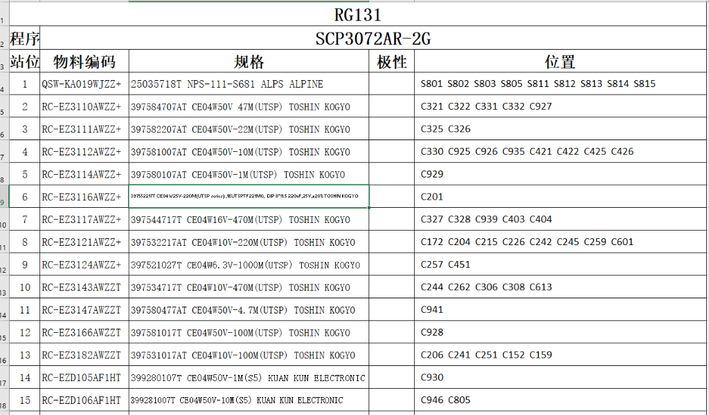
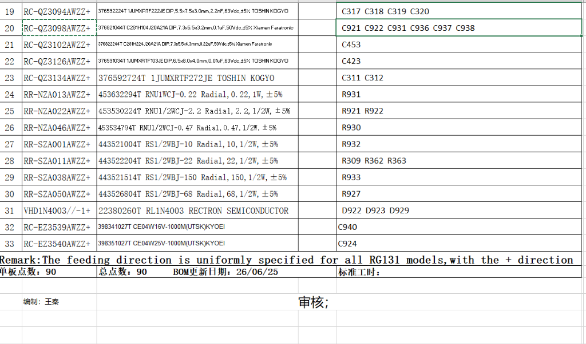
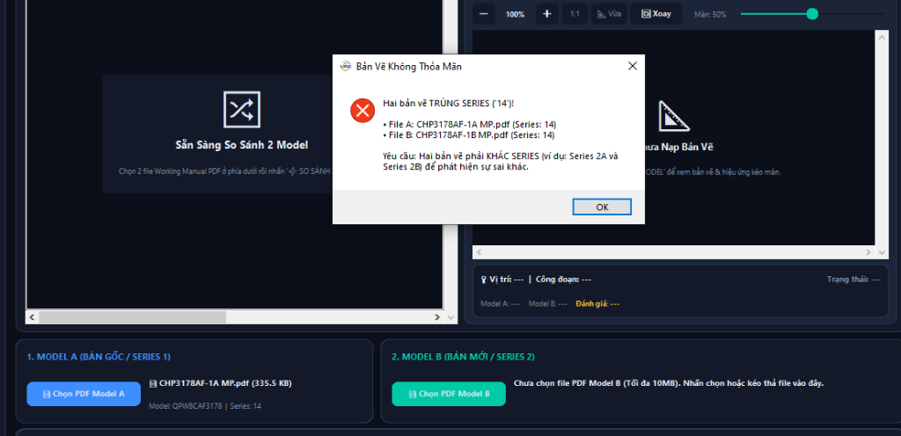
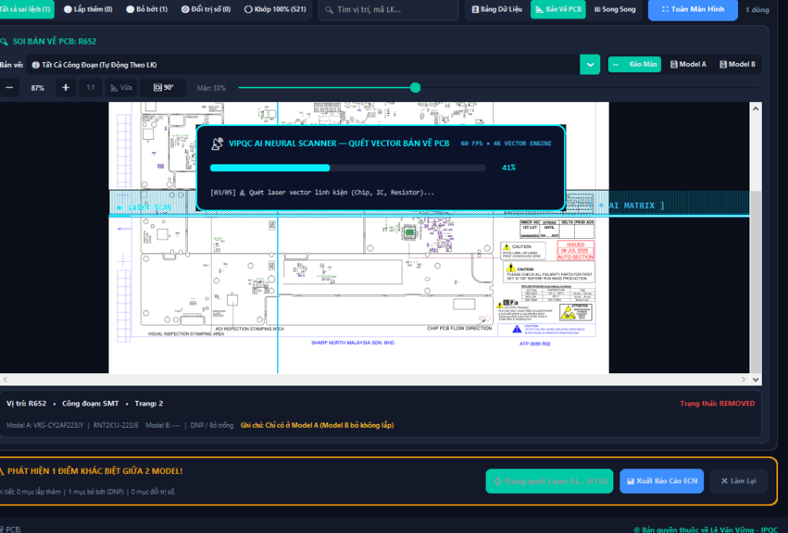
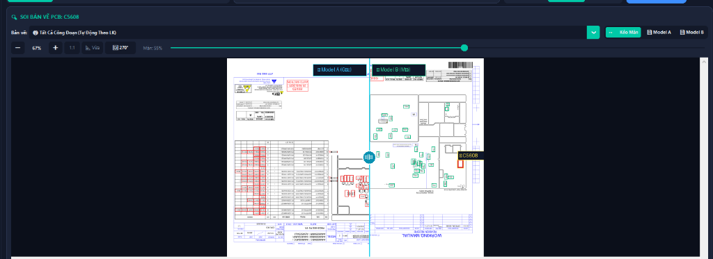
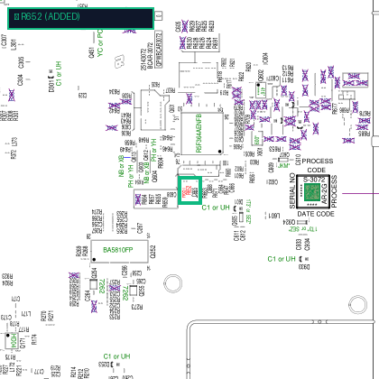

# SỔ TAY HƯỚNG DẪN SỬ DỤNG HỆ THỐNG VIPQC AI
**VIPQC AI — Working Manual BOM Extraction & PCB Drawing Comparator Desktop App**  
*Dành cho Kỹ sư Quản lý Chất lượng (QC/QA), Kỹ thuật Quy trình (PE/ME) và Quản lý Sản xuất*

---

## 1. TỔNG QUAN & KHỞI ĐỘNG ỨNG DỤNG

**VIPQC AI** là phần mềm chuyên dụng hỗ trợ xử lý tài liệu kỹ thuật sản xuất điện tử (Working Manual PDF):
- **Trích xuất tự động dữ liệu BOM** từ tài liệu Working Manual sang định dạng Excel hoàn chỉnh, chuẩn hóa các mã công đoạn (SMT, Radial, DIP, Chip).
- **Đối chiếu BOM Excel với Working Manual PDF** để kiểm soát sai lệch mã linh kiện, số lượng hoặc vị trí chân cắm trước khi đưa vào dây chuyền sản xuất.
- **So sánh trực quan 2 Model / 2 Series bản vẽ PCB**, phát hiện thay đổi kỹ thuật (ECN) bằng công nghệ quét vector AI, hỗ trợ kéo rèm đối chiếu trước/sau và khoanh vùng Spotlight linh kiện tức thì.

### Cách Khởi Chạy
1. Nhấp đúp chuột vào tệp **`VIPQC AI.exe`** (hoặc **`BOM_Extractor.exe`**) trong thư mục ứng dụng.
2. Ứng dụng là phần mềm độc lập (Portable), không yêu cầu cài đặt thêm thư viện hay phần mềm trung gian.

### Tùy Biến Giao Diện
- **Chế độ Sáng / Tối (Dark / Light Mode)**: Chọn menu ở góc trên cùng bên phải để chuyển đổi giữa giao diện Cyberpunk Dark hiện đại hoặc giao diện Light thanh lịch cho văn phòng.
- **Đa ngôn ngữ**: Hỗ trợ chuyển đổi tức thì giữa **Tiếng Việt**, **中文 (Tiếng Trung)** và **English**.

---

## 2. CHỨC NĂNG 1: TRÍCH XUẤT BOM TỰ ĐỘNG (PDF $\rightarrow$ EXCEL)

*Hình 1: Giao diện chính phân hệ Trích Xuất BOM từ tài liệu Working Manual sang Excel.*

### Các Bước Thực Hiện:
1. **Nạp Tệp Working Manual PDF**:
   - Bấm nút **`➕ Thêm Tệp PDF`** để chọn một hoặc nhiều tệp PDF.
   - Bấm nút **`📁 Thêm Thư Mục`** để nạp toàn bộ các file PDF trong thư mục dự án.
   - Hoặc **Kéo & Thả** trực tiếp các file PDF từ File Explorer vào cửa sổ phần mềm.
2. **Quan Sát Chỉ Số Thống Kê**:
   - Thanh trạng thái RGB trên đỉnh cung cấp nhanh 3 thông số: **Số tệp đã chọn**, **Tổng số linh kiện** và **Tổng số lượng (Qty)**.
3. **Lọc Dữ Liệu Theo Công Đoạn**:
   - Hệ thống tự động phân loại linh kiện theo các tab màu sắc:
     - **Tất Cả**: Hiển thị danh mục toàn bộ bo mạch.
     - **CHA (Xanh dương)**: Công đoạn dán bề mặt SMT Chip.
     - **RAD (Cam)**: Công đoạn cắm tự động linh kiện hướng tâm (Radial/Axial).
     - **SCP / DIP (Xanh ngọc)**: Công đoạn cắm tay/hàn sóng (DIP/Manual).
     - **CHP (Tím)**: Công đoạn dán chip phụ trợ.
4. **Tìm Kiếm Linh Kiện Nhanh**:
   - Nhập mã linh kiện (Part Code) hoặc ký hiệu vị trí (Ref Des như `R652`, `C101`, `IC500`) vào ô tìm kiếm góc phải để lọc kết quả tức thì.
5. **Cấu Hình Xuất Excel**:
   - Chọn **`Xuất từng file riêng lẻ`**: Mỗi tệp PDF sẽ xuất ra 1 file Excel riêng có cấu trúc nhiều sheet (Báo cáo tổng hợp, Matrix và từng công đoạn).
   - Chọn **`Gom thành 1 file tổng (Batch)`**: Tự động tổng hợp tất cả các bản vẽ vào tệp `Master_Consolidated_BOM.xlsx`.
6. **Thực Hiện & Mở Kết Quả**:
   - Bấm **`⚡ TRÍCH XUẤT BOM AI`** để kích hoạt động cơ trích xuất.
   - Sau khi hoàn thành, bấm **`📊 Mở Excel`** hoặc **`📂 Mở Thư Mục`** để xem kết quả.

---

## 3. CHỨC NĂNG 2: ĐỐI CHIẾU BOM (EXCEL NHÀ MÁY vs PDF BẢN VẼ)

*Hình 2: Phân hệ Đối Chiếu BOM kiểm tra sai khác giữa bảng tính Excel và Working Manual PDF.*

### Mục Đích:
Đảm bảo danh sách vật tư cấp phát sản xuất (BOM Excel của ERP/SAP) trùng khớp 100% với tài liệu chỉ dẫn sản xuất Working Manual PDF từ bộ phận thiết kế R&D.

### Các Bước Thực Hiện:
1. Tại thanh điều hướng bên trái, bấm chọn chế độ **`🔄 ĐỐI CHIẾU BOM`**.
2. **Nạp Tệp Dữ Liệu**:
   - **Bên Trái**: Bấm chọn hoặc kéo thả tệp **BOM Excel** của nhà máy (`.xlsx`, `.xls`).
   - **Bên Phải**: Bấm chọn hoặc kéo thả tệp **Working Manual PDF** tương ứng.
3. **Bấm `⚡ ĐỐI CHIẾU BOM NGAY`**:
   - Hệ thống tự động so khớp từng vị trí linh kiện (Ref Des), chủng loại vật tư, quy cách và số lượng.
4. **Đọc Kết Quả Sai Khác**:
   - Bảng phân tích hiển thị trạng thái bằng màu sắc rõ ràng:
     - **✅ Khớp (Matched)**: Hoàn toàn trùng khớp cả mã và số lượng.
     - **⚠️ Lệch Mã (Part Mismatch)**: Cùng vị trí lắp đặt nhưng mã linh kiện trong Excel khác với PDF.
     - **❌ Thiếu trong Excel / Thiếu trong PDF**: Phát hiện linh kiện bị sót ở một trong hai tài liệu.
     - **🔢 Lệch Số Lượng (Qty Diff)**: Chênh lệch số lượng đóng gói/lắp đặt.
5. **Xuất Báo Cáo Đối Chiếu**:
   - Bấm nút **`📥 Xuất Báo Cáo Đối Chiếu Excel`** để tải về tệp báo cáo sai khác có định dạng màu phục vụ giải trình kỹ thuật và lưu hồ sơ QC.

---

## 4. CHỨC NĂNG 3: SO SÁNH 2 MODEL & BẢN VẼ PCB (SAI KHÁC ECN)

Phân hệ mạnh mẽ nhất giúp kỹ sư so sánh hai đời máy hoặc hai phiên bản revision (ECN) của bản vẽ bo mạch.

### A. Quy Tắc Xác Thực (Validation) Bắt Buộc
> **Lưu ý quan trọng:** Để tránh nhầm lẫn trong sản xuất, hệ thống áp dụng quy tắc kiểm tra nghiêm ngặt:
> **Hai bản vẽ phải CÙNG MODEL nhưng KHÁC SERIES** mới cho phép tải lên và so sánh.

- **Ví dụ Hợp Lệ**:
  - `CHP3178AF-1A MP.pdf` vs `CHP3178AF-1B MP.pdf` *(Cùng Model `CHP3178AF`, Series `1A` và `1B`)* $\rightarrow$ **ĐƯỢC CHẤP NHẬN**.
  - `3275-2A.pdf` vs `3275-2B.pdf` *(Cùng Model `3275`, Series `2A` và `2B`)* $\rightarrow$ **ĐƯỢC CHẤP NHẬN**.
- **Ví dụ Không Hợp Lệ (Bị chặn an toàn)**:
  - Chọn 2 file cùng là `CHP3178AF-1A MP.pdf` $\rightarrow$ Báo lỗi: *Trùng Series*.
  - `3275-2A.pdf` vs `3272-2A.pdf` $\rightarrow$ Báo lỗi: *Khác Model bo mạch*.

*Hình 3: Cơ chế bảo vệ tự động ngăn chặn so sánh nhầm model hoặc trùng series.*

---

### B. Hiệu Ứng Quét Vector AI Laser Scan

Khi bấm **`⚡ SO SÁNH 2 MODEL`**, hệ thống khởi chạy giao diện quét Radar Hologram Cyberpunk 60 FPS:
- Phân tích tọa độ linh kiện đa tầng.
- Tự động đối chiếu từng vị trí SMD, IC, trở, tụ giữa 2 bản vẽ.
- Lọc bỏ các thông tin nhiễu để tập trung vào các điểm có sự thay đổi vật tư.

*Hình 4: Cyberpunk Laser HUD hiển thị tiến trình bóc tách và so khớp tọa độ linh kiện.*

---

### C. Chế Độ Kéo Màn Trực Quan (↔️ Kéo Màn — Curtain Mode)

Sau khi quét hoàn tất, giao diện hiển thị chế độ làm việc tối ưu:

*Hình 5: Chế độ ↔️ Kéo Màn cho phép kéo thanh chia giữa Model A (bên trái) và Model B (bên phải).*

1. **Thanh Chia Màn ↔️ Kéo Màn**:
   - Dùng chuột kéo vạch xanh Cyan `◂||▸` sang trái hoặc phải (hoặc dùng thanh trượt `Màn: 50%`).
   - Phía bên trái vạch chia thể hiện **Model A (Bản gốc)**.
   - Phía bên phải vạch chia thể hiện **Model B (Bản mới)**.
   - Kỹ sư có thể nhìn thấy linh kiện thay đổi xuất hiện/biến mất ngay tại đường ranh giới trượt.
2. **Chế Độ Hiển Thị Không Gian**:
   - **`◫ Song Song`**: Chia đều 50% Bảng dữ liệu và 50% Khung bản vẽ.
   - **`🖼️ Bản Vẽ`**: Mở rộng khung bản vẽ chiếm trọn 100% màn hình để quan sát chi tiết mạch in.
   - **`📋 Bảng`**: Tối đa hóa bảng dữ liệu để kiểm tra danh mục linh kiện.
3. **Bộ Công Cụ Thao Tác Bản Vẽ**:
   - **Phóng to / Thu nhỏ**: Bấm `➕` / `➖` hoặc cuộn chuột (hỗ trợ zoom mượt mà lên tới **500%**).
   - **Tỉ lệ 1:1**: Đưa bản vẽ về đúng kích thước chuẩn 100%.
   - **📐 Vừa**: Tự động cân bằng bản vẽ vừa khít với khung làm việc.
   - **🔄 Xoay**: Xoay bản vẽ theo các góc 90°, 180°, 270° theo hướng dây chuyền sản xuất.
   - **Kéo Rê Tự Do (2D Pan)**: Nhấn giữ chuột trái (ngoài thanh rèm) hoặc **Chuột giữa (B2)** để kéo bản vẽ sang trái, sang phải, lên, xuống tự do với tốc độ 60+ FPS.

---

### D. Tính Năng Khoanh Vùng Tiêu Điểm Linh Kiện (Spotlight)

Khi nhấp chuột vào bất kỳ linh kiện nào trong danh sách sai khác (ví dụ `R652`):
- Hệ thống tự động cuộn và căn giữa linh kiện trên bản vẽ.
- Vẽ **khung viền đỏ nổi bật (Spotlight Box)** chính xác vào chân linh kiện cần kiểm tra.

*Hình 6: Khung viền đỏ định vị chính xác vị trí linh kiện bị thay đổi trên mạch in.*

---

## 5. CHỨC NĂNG 4: SO SÁNH 2 BOM CÙNG MODEL KHÁC SERIES (FAI INSPECTION)

Phân hệ chuyên biệt phục vụ công tác kiểm tra đầu tiên (FAI - First Article Inspection) và kiểm soát thay đổi linh kiện giữa 2 Series của cùng một Model:
- Hỗ trợ cả **PDF Bóc Tách Đa Cấp ERP** (多階材料用量清單列印) và **Excel BOM** (`.xlsx`, `.xls`).
- **Giao diện bảng toàn màn hình**: Tối ưu hóa không gian làm việc cho QC, loại bỏ sơ đồ bản vẽ để tập trung tối đa vào danh mục và chỉ dẫn kiểm tra.
- **QC Focus Checklist**: Tự động lọc ra chỉ những linh kiện có sự thay đổi (Thêm mới, Bỏ trống DNP, Đổi mã vật tư) để QC kiểm tra trọng tâm, không cần rà soát lại hàng trăm linh kiện trùng khớp.
- **Tương tác đổi trạng thái kiểm tra**: Nhấp chuột trực tiếp vào từng dòng để chuyển đổi trạng thái `⏳ Chờ kiểm` ➔ `✅ ĐÃ DUYỆT (OK)` ➔ `❌ LỖI (NG)`.
- **Thanh tiến độ kiểm tra FAI**: Tự động tính toán tỷ lệ % linh kiện đã kiểm duyệt thời gian thực.
- **Xuất Biên bản FAI Excel**: Xuất file báo cáo chi tiết có chỉ dẫn hành động (Action Guide) và trạng thái duyệt cho bộ phận QC & SMT.

---

## 6. BẢNG TỔNG HỢP PHÍM TẮT & THAO TÁC NHANH

| Thao Tác | Hành Động | Tác Dụng |
|:---|:---|:---|
| **Kéo Thả File** | Kéo file từ Desktop / Explorer vào app | Nạp nhanh file PDF hoặc Excel vào hệ thống |
| **Kéo Chuột Trái (B1)** | Kéo tại thanh phân chia rèm `◂||▸` | Thay đổi tỉ lệ so sánh rèm giữa Model A và Model B (Chức năng 3) |
| **Kéo Chuột Trái (B1)** | Kéo ngoài phạm vi thanh chia rèm | Kéo rê (Pan) bản vẽ sang trái/phải/lên/xuống tự do (Chức năng 3) |
| **Chuột Giữa (B2)** | Nhấn giữ chuột giữa và di chuyển | Di chuyển bản vẽ không bị phụ thuộc vào vị trí chuột |
| **Cuộn Chuột** | Lăn bánh xe cuộn chuột trên Canvas | Cuộn theo chiều dọc của bản vẽ |
| **Bấm Đúp Vào Hàng** | Nhấp đúp chuột vào linh kiện trên bảng | Xem thông tin chi tiết linh kiện & quy cách |
| **Phím Tìm Kiếm** | Gõ ký tự vào ô tìm kiếm | Lọc tức thì theo mã linh kiện hoặc vị trí |

---

## 7. LƯU Ý KỸ THUẬT QUAN TRỌNG

1. **Giới Hạn Dung Lượng Tệp**:
   - Hệ thống đặt ngưỡng an toàn **tối đa 10 MB cho mỗi tệp PDF**. Nếu tệp vượt quá 10 MB, ứng dụng sẽ cảnh báo để bảo vệ bộ nhớ RAM máy tính, tránh tình trạng đơ ứng dụng trong quá trình kết xuất đồ họa độ phân giải cao.
2. **Quy Tắc Đặt Tên Tệp**:
   - Khuyến khích đặt tên tệp theo quy chuẩn mã sản phẩm công xưởng, ví dụ:  
     `<Tên_Model>-<Series> <Hậu_tố>.pdf` (ví dụ: `CHP3178AF-1A MP.pdf` và `CHP3178AF-1B MP.pdf`).
   - Phần mềm đã tích hợp bộ lọc thông minh tự động loại bỏ các từ khóa thừa như `MP`, `PP`, `(1)`, `Copy` để nhận diện chính xác Model và Series.
3. **Lưu Trữ Báo Cáo**:
   - Toàn bộ các file kết quả trích xuất và đối chiếu mặc định được lưu trong thư mục `excel_results/`. Bạn có thể thay đổi đường dẫn lưu trữ bất kỳ lúc nào tại ô **Cài đặt thư mục đầu ra**.

